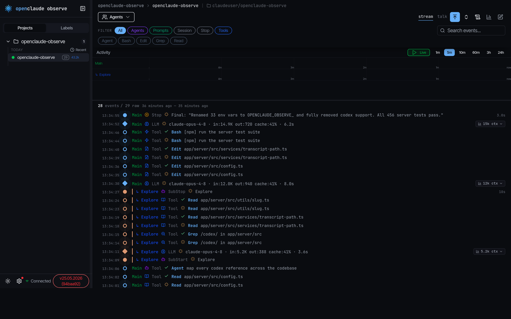

# OpenClaude Observe

Real-time observability for [OpenClaude](https://github.com/coffeegrind123/openclaude). Point your agent at a URL and watch what it actually does — every tool call, model generation, subagent, and cross-process message — land in a live dashboard. The same app also browses and edits OpenClaude's on-disk memory, including a force-directed graph of how your notes link together.

No plugin, no hook scripts, no MCP server. One environment variable.

<p align="center">
  
</p>

## What it is

OpenClaude emits hook events and OpenTelemetry spans as it runs. Observe is the other end of that wire: a small [Hono](https://hono.dev) server that ingests those events over HTTP, stores them in SQLite, and streams them to a React dashboard over a WebSocket. It has two surfaces:

- **Observe** — a live feed of a session's events, a per-agent activity timeline, the agent/subagent hierarchy, multi-instance topology (daemon / pipe / coordinator / bridge), and token + cost accounting.
- **Memory** — a browser and editor for OpenClaude's file-based memory under `~/.claude`, with a structured frontmatter editor, wikilink backlinks, and an interactive graph view.

## Quick start

Docker is the primary path:

```bash
git clone https://github.com/coffeegrind123/openclaude-observe.git
cd openclaude-observe
docker compose up -d openclaude-observe   # or: just start
```

Open <http://localhost:4981>. Then point OpenClaude at the server and restart your session:

```bash
export CLAUDE_OBSERVE_URL=http://localhost:4981
```

Events stream in automatically. The integration is compiled into OpenClaude — an in-process OTel exporter plus hook forwarding — so there is nothing to install on the agent side.

> **Prerequisites:** [Docker](https://www.docker.com/). [Node.js](https://nodejs.org/) and [just](https://github.com/casey/just) are only needed for local development.

## How OpenClaude connects

OpenClaude POSTs every event to `POST /api/events` at `CLAUDE_OBSERVE_URL`. Two in-process producers feed it:

- **hook forwarding** — native session, tool, subagent, and notification hooks forwarded as they fire;
- **the OTel exporter** — spans for model generations and the daemon / pipe / coordinator / bridge subsystems.

Observe is a pure consumer. There are no agent-side plugins, hook scripts, or MCP servers to configure — only the `CLAUDE_OBSERVE_URL` variable.

## The Observe dashboard

- **Event feed** — a virtualized, live list of a session's events. Each row shows its agent, timestamp, and a one-line summary, and expands inline into a typed viewer. Newest-on-top is optional.
- **Stream ↔ Talk** — flip the same session between the raw event stream and **Talk**, which renders just the conversation (prompts, assistant and subagent messages) as markdown — code highlighting, diffs, extended-thinking blocks, and per-tool viewers for Bash, Edit, Read, Write, Grep, and Mermaid.
- **Activity timeline** — per-agent lanes (main + each subagent) on a shared time-spine, with live tailing and zoom from `1m` to `24h`. Scrub into **rewind** to freeze the view at any past moment.
- **Agent hierarchy** — subagents thread back to their parent across the lanes, the feed, and the sidebar.
- **Multi-instance topology** — daemon, pipe, coordinator, and bridge events badged by `instance_id`, with live heartbeat tracking.
- **Tokens & cost** — input / output / cache / creation tokens and LLM-call counts per session and per agent, plus an opt-in **transcript-stats** panel that parses `~/.claude/projects` JSONL for per-prompt, per-model token *and dollar-cost* breakdowns using live [models.dev](https://models.dev) pricing.
- **Filters & search** — DB-backed filter rules (RE2 regex, per-filter color, primary / secondary display) with full-text search and one-click agent / tool / session facets.
- **Sidebar & labels** — projects and sessions, pinned sessions, and user-defined labels for tagging sessions across projects.
- **Keyboard-first** — region-jump shortcuts (search, agents, filters, sidebar, feed) with arrow-key navigation, plus a ⌘K command palette.

## The Memory browser

A browser and editor for OpenClaude's file-based memory — the per-fact markdown under `~/.claude/projects/<project>/memory/`, the global `~/.claude/CLAUDE.md`, and per-agent-type memory. Files are read and **written straight to disk** (atomic writes, with an advisory lock compatible with OpenClaude's own), so edits land on the agent's next turn.

- **Stores** grouped as Projects / Global / Agents, correlated to observe projects by slug.
- **Structured + raw editor** — a typed frontmatter form (type, status, provenance, supersedes, evidence) with a raw-markdown toggle and a live preview that renders `[[wikilinks]]`. It reads both the flat and the `metadata:`-wrapped frontmatter schemas.
- **Links** — outgoing links, backlinks, and a supersedes chain, all navigable; `[[ ]]` autocomplete in the editor.
- **Lint** — flags orphaned `MEMORY.md` entries, unindexed files, and broken wikilinks.
- **Graph view** — a force-directed map of a store: one node per file, edges from resolved `[[wikilinks]]`. Color encodes memory type, size encodes link degree, and nodes carry a soft glow. Links are curved and send directional particles along a hovered node's connections; labels stay readable at any zoom (only hubs when zoomed out, de-cluttered so they never overlap). Toggle **List ↔ Graph** from the header; click a node to open it in the editor.

## Architecture

```
OpenClaude (in-process)
  ├─ hook forwarding ──┐
  └─ OTel exporter ────┴─▶ POST /api/events ─▶ parse · dedup · persist ─▶ SQLite
                                                              │
                                          WebSocket  /api/events/stream
                                                              ▼
                                                      React dashboard
```

Ingestion parses each event, deduplicates it by a content signature (hashed fields plus a 5-second time bucket, so retried or doubled exporter sends collapse), resolves its session / project / agent, persists it, and broadcasts to subscribed dashboards. The client derives all agent and timeline state from the event stream — virtualized and dedup'd so multi-thousand-event sessions stay responsive.

| Layer | Stack |
|-------|-------|
| Server | Hono · better-sqlite3 (WAL) · native `ws` · `tsx` runtime |
| Client | React 19 · Tailwind 4 · TanStack Query / Virtual · Zustand · react-force-graph-2d |
| Wire | JSON over HTTP for ingest, JSON over WebSocket for live updates |
| Storage | SQLite at `data/observe.db` (single file, bind-mounted in Docker) |

## Event coverage

28 event subtypes, plus a fallback for anything unrecognized. Any event can carry an `instance_id`, so multi-process runs surface with per-instance badges.

| Category | Events |
|----------|--------|
| **Session** | SessionStart · Stop · UserPromptSubmit · Notification |
| **Tools** | PreToolUse · PostToolUse · PostToolUseFailure · ToolBatch |
| **LLM** | LLMGeneration *(model, in/out/cache tokens, TTFT, duration)* |
| **Subagents** | SubagentStart · SubagentStop |
| **Daemon** | DaemonStart · DaemonStop · DaemonHeartbeat |
| **Pipes (IPC)** | PipeRoleAssigned · PipeAttach · PipeDetach · PipePromptRouted · PipePermissionForward · PipeLanPeerDiscovered |
| **Coordinator** | CoordinatorDispatch · CoordinatorResult |
| **Bridge** | BridgeConnected · BridgeDisconnected · BridgeWorkReceived |
| **System** | SuperModeToggle · CompactionRun · CostUpdate |

## Configuration

Every server setting lives in [`app/server/src/config.ts`](app/server/src/config.ts) and is read from `OPENCLAUDE_OBSERVE_*` environment variables. Copy `.env.example` to `.env` to override.

| Variable | Default | Purpose |
|----------|---------|---------|
| `OPENCLAUDE_OBSERVE_SERVER_PORT` | `4981` | API + UI port |
| `OPENCLAUDE_OBSERVE_LOG_LEVEL` | `debug` | `error` · `warn` · `info` · `debug` · `trace` |
| `OPENCLAUDE_OBSERVE_DB_PATH` | `data/observe.db` | SQLite database file |
| `OPENCLAUDE_OBSERVE_ALLOW_DB_RESET` | `backup` | DB reset policy: `allow` · `backup` · `deny` |
| `OPENCLAUDE_OBSERVE_TRANSCRIPT_STATS` | `1` | Transcript token/cost panel (`0` disables) |
| `OPENCLAUDE_OBSERVE_MEMORY` | `1` | Memory browser/editor (`0` disables it and drops the mount) |
| `OPENCLAUDE_OBSERVE_DEV_CLIENT_PORT` | `5174` | Vite dev client port |

On the OpenClaude side, set `CLAUDE_OBSERVE_URL=http://localhost:4981`.

### Host mounts (Docker)

The compose file bind-mounts your `~/.claude`:

- `~/.claude/projects` → **read-only**, for the transcript-stats panel.
- `~/.claude` → **read-write**, for the Memory editor — a separate mount whose write access is scoped by the memory feature's path guards. Set `OPENCLAUDE_OBSERVE_MEMORY=0` to disable the feature and drop this mount.
- `./data` → the SQLite database and the models.dev pricing cache.

## API

REST + WebSocket, served from the same origin as the dashboard.

| Endpoint | Description |
|----------|-------------|
| `POST /api/events` | Event ingestion (OpenClaude POSTs here) |
| `GET  /api/sessions/recent` | Recent sessions with token rollups |
| `GET  /api/sessions/:id` | Session detail + token totals |
| `GET  /api/sessions/:id/usage` | Tokens + per-agent breakdown |
| `GET  /api/sessions/:id/instances` | Per-session instances (role, pid, heartbeat) |
| `GET  /api/sessions/:id/transcript-stats` | Per-prompt / per-model token + cost from the transcript |
| `GET  /api/memory/stores` | Memory stores (project / global / agent) |
| `GET  /api/memory/stores/:id/files` | File headers for a store |
| `GET  /api/health` | Liveness, version, runtime |
| `WS   /api/events/stream` | Live events + session / instance / notification updates |

## Local development

```bash
just install   # install server + client deps
just dev       # hot reload — API on :4981, Vite client on :5174
just check     # tests + format + client build (run before every commit)
```

`just dev` runs the server under `tsx` watch and the client under Vite with an `/api` proxy; `just start-local` builds the client and serves it from the server without Docker. Run `just --list` for all recipes, and see [docs/DEVELOPMENT.md](docs/DEVELOPMENT.md) for worktrees, environment variables, testing, and code style.

## Project structure

```text
app/
  server/   Hono routes, event parser, SQLite storage, WebSocket,
            transcript + memory services
  client/   React 19 dashboard — observe feed/timeline + memory browser/graph
docs/       Development guide and assets
scripts/    Release + changelog tooling
Dockerfile  Production image (multi-stage: build deps → tsx runtime)
docker-compose.yml   Primary run path
justfile    Task runner
start.mjs   Non-Docker entrypoint (dev / local)
```

## Troubleshooting

| Problem | Fix |
|---------|-----|
| Server not reachable | `just start` (Docker) or `just dev` (hot reload) |
| Port 4981 in use | Set `OPENCLAUDE_OBSERVE_SERVER_PORT=<port>` in `.env` |
| Events not appearing | Check `CLAUDE_OBSERVE_URL` in OpenClaude's env; `curl http://localhost:4981/api/health` |
| WebSocket keeps dropping | The client auto-reconnects and refetches missed events |
| Memory tab empty or disabled | Ensure `OPENCLAUDE_OBSERVE_MEMORY` isn't `0` and `~/.claude` is mounted |
| Database issues | Stop the server, then `just db-reset` (writes a `.bak` when `ALLOW_DB_RESET=backup`) |

## Versioning

Date-based `DD.MM.YYYY` plus a short git hash baked into the image; `/api/health` reports both. Releases before `14.04.2026` used semver — see [CHANGELOG.md](CHANGELOG.md).

## Contributing

[Conventional Commits](https://www.conventionalcommits.org/) (`feat:`, `fix:`, `docs:`, `style:`, `refactor:`, `test:`, `chore:`, `release:`); breaking changes get a `!`. The release script reads `git log` to build the changelog, so prefixes matter. See [CONTRIBUTING.md](CONTRIBUTING.md).

## Acknowledgements

Forked from [simple10/agents-observe](https://github.com/simple10/agents-observe) — itself inspired by [disler/claude-code-hooks-multi-agent-observability](https://github.com/disler/claude-code-hooks-multi-agent-observability) — and rebuilt around OpenClaude's native OTel + hook-forwarding integration. The Memory graph view takes after the [brain-map](https://github.com/vladignatyev/brain-map-skill) skill and Obsidian's graph view.

## License

[MIT](LICENSE)
